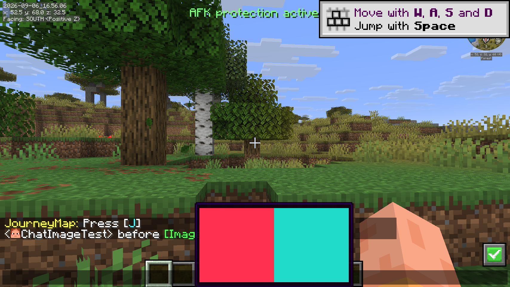
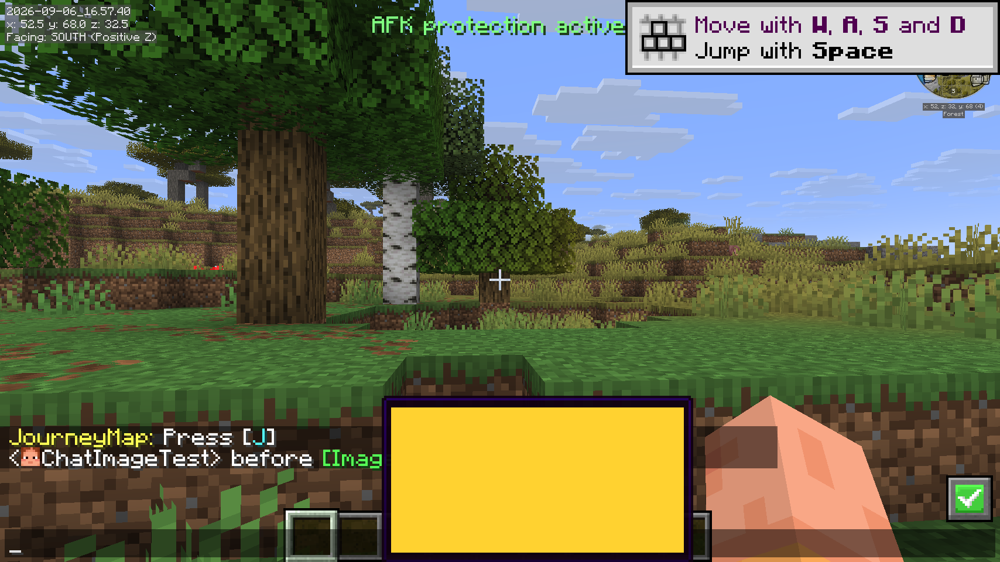

# Fabric 26.2 MCP 验证记录

日期：2026-09-06。平台：macOS arm64，Java 25，Minecraft 26.2，Fabric Loader 0.19.3。

## 产物与环境

- `ChatImage-1.4.7-port.1+26.2.jar`
- SHA-256：`4da71107b556d1e5aef7917dff9b39e2de51f853a647ba17f705d7e856a73d9b`
- Gradle 9.6 `build` 成功，JAR CRC 检查通过，内嵌 ChatImageCode 0.12.2。
- 原实例：`/Applications/HMCL/.minecraft/versions/26.2-Fabric 0.19.3`。
- 使用全部 33 个启用模组，逐文件校验，清单见 [SHA-256 清单](hmcl-mods-sha256.json)。未启用原有禁用模组。
- 在独立 `run` 目录使用离线身份 ChatImageTest 创建单人测试世界，操作通过 Minecraft MCP 完成。
- 最终用 `launch_hmcl_packaged.py` 加载 HMCL 原游戏 JAR 和 91 个依赖库，运行正式产物；运行时读取 ChatImage 类来源确认是 `run/mods/ChatImage-1.4.7-port.1+26.2.jar`。

## 已验证

| 项目 | 结果与证据 |
| --- | --- |
| 全模组启动 | 进入单人世界，MCP 连接正常；Chat Heads、No Chat Reports、More Chat History、Sodium、ImmediatelyFast 等同时加载 |
| PNG 悬浮 | HTTP 图片成功解码并实际绘制，聊天中的绿色图片名称保留 |
| GIF | 两帧成功解码，运行时纹理索引随动画变化；截图另通过固定第二帧确认黄色纹理实际绘制，随后恢复动画速度 |
| 聊天兼容 | 图片消息保留玩家头像与前后文本；最终打包版发送 `before http://127.0.0.1:18762/test.gif after` 显示 `before [Image] after` |
| 协议 | `show_chatimage` HoverEvent codec 编码和解码通过 |
| NSFW | 点击打开原生确认界面；取消仍阻止显示，确认后解锁 |
| 配置 | End 打开设置；图片大小界面、按钮和滑块正常；Mod Menu 的 Configure 可进入设置 |
| 本地发送 | 聊天输入 `/chatimage send` 本地 PNG，解码成功，集成服务器收到 FileChannel 1/1 |
| 文件拖入 | MCP 调用实际 MouseHandler.onDrop 路径，生成 CICode 后通过 Enter 发送；正式打包版日志确认 PNG 解码和 FileChannel 1/1 |
| macOS 图片读取 | 使用隔离命名 NSPasteboard 测试 AppKit PNG/TIFF，PNG 内容一致，TIFF 转 PNG 成功；未覆盖用户剪贴板 |

PNG、协议、NSFW、配置和 AppKit 检查在完整模组开发运行中完成；最终正式 JAR 另复验启动、类来源、HTTP GIF/端口链接、头像共存及文件拖入发送。

## 安装与范围

已将上述同 SHA-256 的 JAR 安装到原实例 `mods`，原目录 39 个已有文件校验均未变化；启用 JAR 数从 33 增为 34。原存档与配置未替换。

本次验证覆盖单人集成服务器，没有验证远程多人之间的本地图片传输，也没有通过用户系统剪贴板执行完整快捷键粘贴流程。日志存在离线身份 Realms 认证提示和平台 OpenGL 提示，未观察到 ChatImage 的 mixin 加载失败或纹理崩溃。
