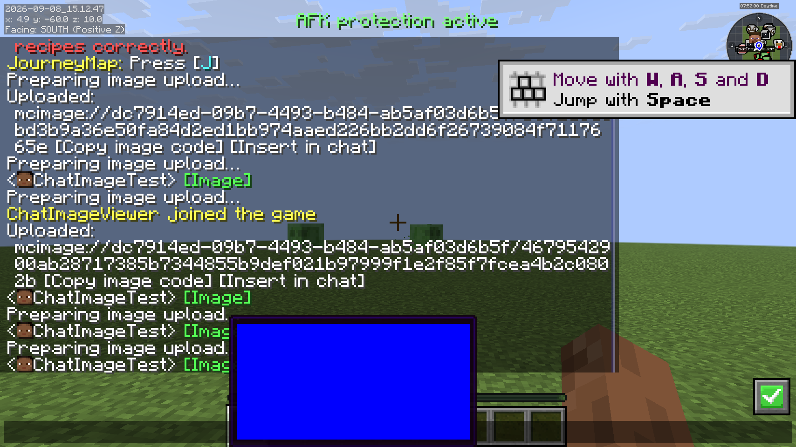

# port.3 上传、压缩与自动动画验证

2026-09-08，macOS arm64，Java 25，Minecraft 26.2，Fabric Loader 0.19.3。

## 构建与离线回归

`./gradlew build` 包含 32 项可重复验证：存储/取回、去重、配额、路径拒绝、重启身份与数据、过期清理、损坏文件、大小上限、WebP 三档有损压缩、透明度/尺寸、GIF/WebP 动画原样保留、WebP 元数据、非等长帧时序、有限/无限循环和精确手动 FPS。

压缩测试使用固定种子的 128×96 图像，低/中/高 WebP 大小为 **10424 / 8520 / 7322 字节**；透明度与尺寸保持，像素值变化证明是有损压缩。

## 独立服务端与两个客户端

在本机回环地址启动独立 Fabric 服务器；客户端 A `ChatImageTest`、客户端 B `ChatImageViewer` 均带原 HMCL 的 33 个启用模组与新 ChatImage JAR，通过两个独立 MCPFabric 桥接端口操作。B 使用新建游戏目录，无 A 的 ChatImage 图片缓存。

- A 通过真实聊天输入 `/chatimage upload`，服务器保存 WebP 并返回含“复制图片引用”“填入聊天”点击动作的本地消息；未向公屏广播上传命令或文件路径。
- A 通过实际 MouseHandler.onDrop 生成本地图片输入，再按 Enter：先上传，再向服务器发送 `mcimage://服务器ID/哈希` 的 CICode。
- 788100 字节的 PNG 经分块上传后保存为约 167 KiB 的 WebP；A 发送引用，B 经网络取回并成功加载 **512×512** 纹理。
- A 上传三帧 GIF 和三帧 WebP 动画，B 均加载为 **3 帧**；两者的原始时长均为 **100 / 400 / 200 ms**，播放两遍。
- 在 B 的实际解码结果中，时间点 `0 / 100 / 499 / 500 / 700 / 1400 ms` 对应帧索引 **0 / 1 / 1 / 2 / 0 / 2**，验证原始逐帧时长与有限循环停止。
- 实际悬浮绘制 WebP 动画，结束后停留蓝色末帧，聊天头像正常共存。

## 正式服务端 JAR 与失败路径

另外使用 Fabric Installer 1.1.2 启动正式服务端 JAR，服务端仅装 Fabric API 和 ChatImage，未使用开发源码替代 JAR；重启后旧图片和服务器 ID 保持。

通过 MCPFabric 注入测试接收器（保留正常分发）实际发送协议请求，10 项断言全部通过，覆盖能力协商、超限大小、其他服务器 ID、路径穿越式非法哈希、不存在引用、错误分块偏移、频率限制、损坏图片。[原始响应](evidence/port3-protocol-results.json)。测试脚本为 `mcp_protocol_checks.py`，需显式指定测试客户端桥接配置。

服务端 `enabled=false` 后重启并重新连接，上传命令明确提示上传已关闭。无服务端模组时的降级及最终产物校验见本文末尾的发布验证补充。

## 验证范围

本轮的剪贴板入口与拖入共用上传拦截流程，未替换用户系统剪贴板做端到端测试；前一轮已用隔离命名 pasteboard 验证 PNG/TIFF 图片读取。GIF/WebP 动画保留原文件，不做动画格式转换或动图有损压缩。HTTP 图片仍走原有下载路径，新解码逻辑支持 GIF/WebP 动画。

本机测试服务器为临时离线身份、只监听 127.0.0.1。未修改任何远端服务器或用户存档。

## 发布验证补充

在移除服务端 ChatImage 后重新连接，上传命令提示服务器不支持，且 HTTP WebP 动图链接仍成功加载三帧。服务端关闭上传时明确提示已关闭。后续修正使用“空闲 90 秒”超时以适应后台限帧，并将手动 FPS 改为精确的按秒计算。

本轮最终构建含 32 项离线回归检查，通过 `build`；发布 JAR 的 SHA-256：

`e09dd03da431c52c5c0c6fea9a81e78a425e835ee453bd4fe8cd7c5f7dd992f6`

最终中文 UI 验证：End 可打开“聊天栏图片显示”，默认“按图片时序自动播放：开”，有手动动画 FPS 滑块。上传发送命令保留带引号的中文图片名称。修正了滑块浮点截断导致每次打开设置降低 1 FPS 的问题。
